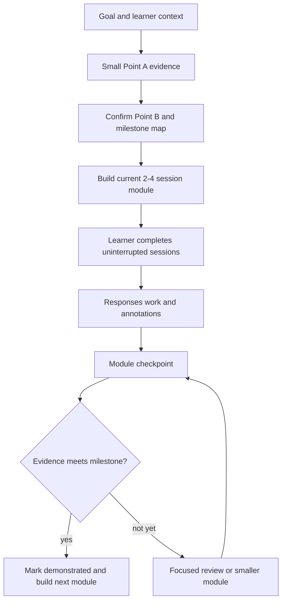

# Buffered Adaptive Loop

Use one visible path map, a fully authored current module, and asynchronous
agent adaptation. The learner should never need an agent turn between ordinary
Blocks.

## Planning horizon

| Horizon         | Detail                                                            |
| --------------- | ----------------------------------------------------------------- |
| Whole path      | 3–7 milestone titles, capability outcomes, and evidence targets.  |
| Current module  | 2–4 complete sessions plus review and checkpoint.                 |
| Later modules   | Provisional titles and outcomes only.                             |
| Optional runway | Consolidation, retrieval, or stretch work ready without an agent. |

Point A chooses placement. It does not force tiny content generation. Point B
and the milestone evidence targets give the learner a stable sense of
direction while later details remain adaptable.

## Flow



## Fast orchestration lane

When the active surface supports subagents and a confirmed module has at least
two independent later outputs, explicitly spawn two direct workers in parallel.
Do not leave this as an implicit option. The parent agent stays in the learner
conversation and owns every durable state transition. Workers return concise
drafts or findings to the parent; they do not teach, place, or hand off directly
to the learner.

Use the current surface's direct workers without promising a faster worker
model. Codex may accept a named worker while still inheriting the parent's
model and reasoning effort. Other harnesses may expose different controls, but
the learner-facing contract must not depend on a model switch.

| Phase | Parent agent | Safe worker lane |
| --- | --- | --- |
| Map proposal | Gather evidence, write and show the persisted map, answer the learner | After the map is visible, research vocabulary, prerequisite risks, or examples that survive likely map edits |
| Await confirmation | Remain responsive and revise the proposal | Continue only low-risk research; do not draft session Sources |
| Confirmed runway | Write the module contract, shared index, skeletons, and first session; integrate and verify | Fact-check or draft distinct later session, review, or checkpoint files |
| Learner in module | Respond to questions and preserve ready material | Investigate a bounded factual question or annotation without rewriting the module speculatively |
| Checkpoint | Make placement, remediation, and Point A decisions; write shared state | Independently summarize durable evidence against the existing rubric or research the likely next module |

Use the smallest useful team, normally the parent plus two or three direct
workers. Give every worker one output, one owner, and a clear return shape.
Prefer read-only research and reviews; when workers author, assign separate
files. Do not allow nested delegation, concurrent edits to shared indexes,
profile or activity files, or unreviewed worker output in learner-facing
Sources.

Skip the worker lane when the module has no two independent later outputs,
learner context cannot be minimized safely, the contract is unresolved, or
coordination would take longer than the remaining work. Continue in the parent
without making the learner wait.

Share confirmed outcomes, module dependencies, audience level, shared
terminology, example or data model, link targets, and the exact file boundary.
Ask workers for focused checks only; the parent runs one full check after
integration. Omit learner identity and any profile detail that the worker does
not need.

Set a join point before learner handoff. If a worker misses it, conflicts, or
costs more to coordinate than the remaining task, the parent completes or
reassigns that output instead of waiting. If the learner changes the goal, the
parent redirects or stops stale work. If workers are unavailable, continue in
the parent without mentioning an internal tooling limitation.

Do not poll workers repeatedly. Complete the first session and integration
preparation after spawning them, then wait once at the fixed join point.

## One module

A module has one coherent capability destination. Prepare all its sessions
before opening Session 1.

```text
Module arrival
├── Session 1: model and guided practice
├── Session 2: varied or independent practice
├── Session 3: transfer or integration, when needed
├── Optional review and stretch work
└── Milestone checkpoint
```

Keep the module small enough to revise after new evidence. Do not pre-author
every future module.

## One session

Give every session a visible destination and completion point:

1. Orient the learner and preview the session.
2. Model the idea with a worked example.
3. Guide one attempt with optional hints.
4. Ask for an independent or transfer attempt.
5. Provide immediate rationale, comparison, or rubric.
6. Invite reflection or annotation.
7. Summarize progress and point to the next ready session.

Use pre-authored help for ordinary friction. Reserve agent review for work that
benefits from judgment or changes placement.

## Feedback cadence

| Evidence                      | Response                                               |
| ----------------------------- | ------------------------------------------------------ |
| Small uncertainty             | Continue; add it to review or annotations.             |
| Session misconception         | Use ready hints, example, or short consolidation.      |
| Repeated core difficulty      | Agent prepares focused review or a smaller module.     |
| Milestone demonstrated        | Record evidence and advance.                           |
| Goal or circumstances changed | Renegotiate Point B, pace, or presentation explicitly. |

Do not use a no-core-miss gate after every session. Gate only when a later
capability genuinely depends on the missing idea.

## Durable state

Record:

- confirmed learner and style preferences;
- Point A evidence and Point B;
- milestone status and current foreground path;
- completed sessions and linked work;
- checkpoint syntheses and placement decisions;
- open review items and annotations;
- explicit goal or pace changes.

Keep completed evidence append-only. Revise future plans without rewriting the
learner's history.
