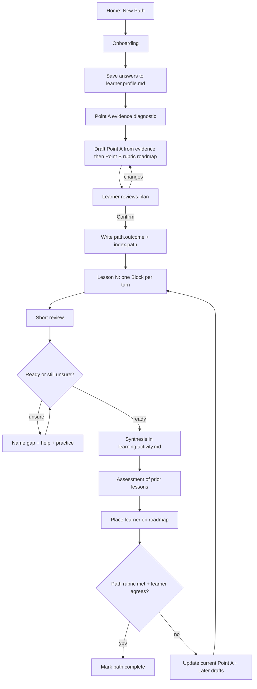
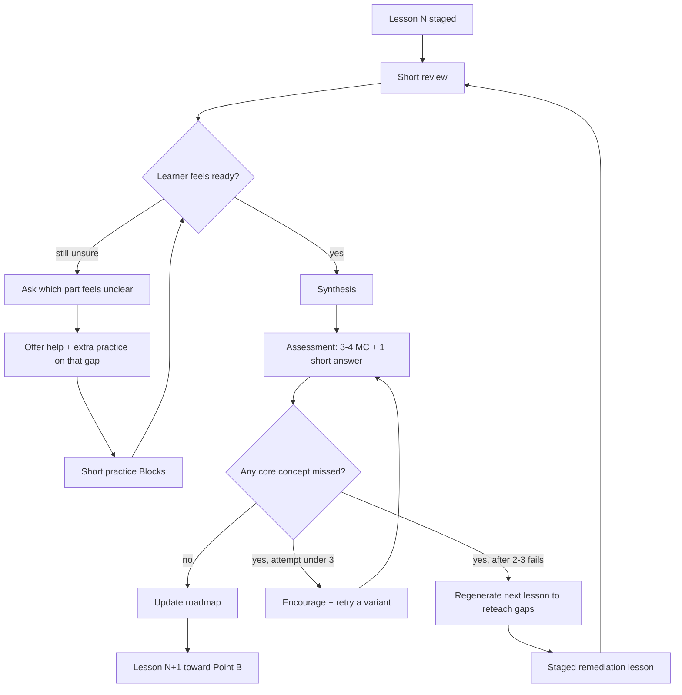
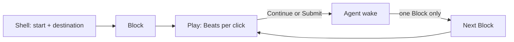

# Adaptive Loop Example

The chess fixture is the full `/path` loop: onboard → Point A evidence →
confirm plan → staged lesson → review → optional practice → assessment →
placement or remediation.

Buildable Sources live under
[`tests/fixtures/path/paths/chess-opening-principles/`](../../../tests/fixtures/path/paths/chess-opening-principles/).
The longer design brief is
[`work-log/2026-07-20-adaptive-learning-loop.brief.md`](../../../work-log/2026-07-20-adaptive-learning-loop.brief.md).

## Flow

### Between lessons

### Inside a lesson

One agent turn = one Block with a stable `id`. Persist `stage` in lesson
frontmatter after each turn so reload resumes from the Source, not from chat.

## Journey

1. [Onboarding](../../../tests/fixtures/path/paths/chess-opening-principles/onboarding/index.lesson.md)
2. [Point A evidence](../../../tests/fixtures/path/paths/chess-opening-principles/onboarding/point-a-evidence.md)
3. [Confirm plan](../../../tests/fixtures/path/paths/chess-opening-principles/onboarding/confirm-plan.md)
4. [Lesson 1](../../../tests/fixtures/path/paths/chess-opening-principles/lessons/control-center-development/index.lesson.md)
5. [Short review](../../../tests/fixtures/path/paths/chess-opening-principles/lessons/control-center-development/lesson.review.md)
6. [Extra practice](../../../tests/fixtures/path/paths/chess-opening-principles/lessons/control-center-development/lesson.practice.md) (only if unsure)
7. [Assessment](../../../tests/fixtures/path/paths/chess-opening-principles/lessons/control-center-development/lesson.assessment.md) — pass = no core miss
8. [Lesson 2 shell](../../../tests/fixtures/path/paths/chess-opening-principles/lessons/develop-before-queen/index.lesson.md) after a pass
9. [Remediation shell](../../../tests/fixtures/path/paths/chess-opening-principles/lessons/reteach-opening-principles/index.lesson.md) after 2–3 core fails

## Supporting workspace files

- [Learner profile](../../../tests/fixtures/path/paths/learner.profile.md)
- [Learning activity](../../../tests/fixtures/path/paths/learning.activity.md)
- [Flashcard component](../../../tests/fixtures/path/paths/assets/learning.components.md)

## Placement rules shown in the fixture

| Result | Next |
| --- | --- |
| Pass (no core miss) | Next Later draft toward Point B |
| Pass + peripheral miss | Advance, with a short reteach of the gap |
| Core miss, under 3 attempts | Variant retry from the same rubric |
| Core miss 2–3 times | Remediation lesson, then review → assess |
| Remediation assess also fails | Renegotiate Point B or pace |

The compact SQL example in [worked-example.md](./worked-example.md) still shows
the five core durable files at one moment in a simpler loop.
