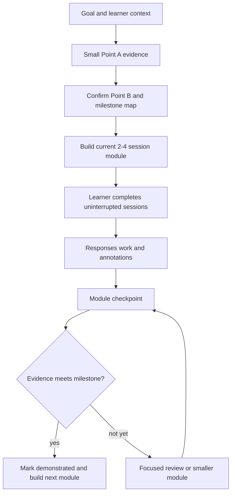

# Buffered Adaptive Loop

Use one visible path map, a fully authored current module, and asynchronous
agent adaptation. The learner should never need an agent turn between ordinary
Blocks.

## Planning horizon

| Horizon         | Detail                                                            |
| --------------- | ----------------------------------------------------------------- |
| Whole path      | 3–7 milestone titles, capability outcomes, and evidence targets.  |
| Current module  | 2–4 complete sessions plus review and checkpoint.                 |
| Later modules   | Provisional titles and outcomes only.                             |
| Optional runway | Consolidation, retrieval, or stretch work ready without an agent. |

Point A chooses placement. It does not force tiny content generation. Point B
and the milestone evidence targets give the learner a stable sense of
direction while later details remain adaptable.

## Flow



## One module

A module has one coherent capability destination. Prepare all its sessions
before opening Session 1.

```text
Module arrival
├── Session 1: model and guided practice
├── Session 2: varied or independent practice
├── Session 3: transfer or integration, when needed
├── Optional review and stretch work
└── Milestone checkpoint
```

Keep the module small enough to revise after new evidence. Do not pre-author
every future module.

## One session

Give every session a visible destination and completion point:

1. Orient the learner and preview the session.
2. Model the idea with a worked example.
3. Guide one attempt with optional hints.
4. Ask for an independent or transfer attempt.
5. Provide immediate rationale, comparison, or rubric.
6. Invite reflection or annotation.
7. Summarize progress and point to the next ready session.

Use pre-authored help for ordinary friction. Reserve agent review for work that
benefits from judgment or changes placement.

## Feedback cadence

| Evidence                      | Response                                               |
| ----------------------------- | ------------------------------------------------------ |
| Small uncertainty             | Continue; add it to review or annotations.             |
| Session misconception         | Use ready hints, example, or short consolidation.      |
| Repeated core difficulty      | Agent prepares focused review or a smaller module.     |
| Milestone demonstrated        | Record evidence and advance.                           |
| Goal or circumstances changed | Renegotiate Point B, pace, or presentation explicitly. |

Do not use a no-core-miss gate after every session. Gate only when a later
capability genuinely depends on the missing idea.

## Durable state

Record:

- confirmed learner and style preferences;
- Point A evidence and Point B;
- milestone status and current foreground path;
- completed sessions and linked work;
- checkpoint syntheses and placement decisions;
- open review items and annotations;
- explicit goal or pace changes.

Keep completed evidence append-only. Revise future plans without rewriting the
learner's history.
