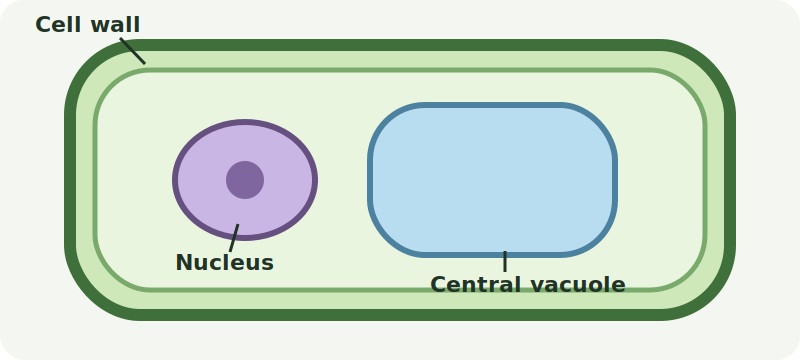

# PathMX Media

PathMX supports standard Markdown images and HTML `figure`, `img`, `video`, and `audio` elements. Use Markdown for simple images and HTML when you need captions or playback controls.

Media is automatically treated as a PathMX Beat. A complete `figure` is one Beat; an image inside that figure does not become a second Beat.

## Quick reference

| Media | Recommended syntax |
| --- | --- |
| Image | `` |
| Linked image | `[](./assets/full-image.jpg)` |
| Captioned image | `<figure>` with `` and `<figcaption>` |
| Video Beat | `<figure>` containing `<video>` and a caption |
| Audio Beat | `<figure>` containing `<audio>` and a caption |

## Images

Use standard Markdown image syntax:

```md

```

The text inside `[...]` is the image's alternative text. Describe the information the image communicates, not merely its appearance.

Paths are resolved relative to the Markdown file. For example, a lesson at `paths/lessons/cells.lesson.md` can use an image in `paths/assets/plant-cell.png` like this:

```md

```

### Live local image example

Source:

```md

```

Rendered result:


This image is stored in the repository at `./assets/pathmx-media-example.svg`. Its appearance here confirms that PathMX resolves the relative path, copies the asset into the build, and renders the Markdown image.

## Captions with figures

Markdown has no caption syntax. Use a semantic HTML figure when a caption helps the learner:

```html
<figure><figcaption>Figure 1: A caption explains why the image matters.</figcaption></figure>
```

Rendered result:

<figure><figcaption>Figure 1: A caption explains why the image matters.</figcaption></figure>

Keep the complete figure on one line so the current PathMX Markdown pipeline parses it as one HTML element. Do not add a second Markdown image inside the same figure; the figure already provides the media Beat.

## Video

Use an HTML `video` element inside a figure. Always include `controls` so the learner can pause, replay, and seek:

```html
<figure><video controls preload="metadata" src="https://interactive-examples.mdn.mozilla.net/media/cc0-videos/flower.mp4">Your browser does not support HTML video.</video><figcaption>A short time-lapse video of a flower opening.</figcaption></figure>
```

Rendered result:

<figure><video controls preload="metadata" src="https://interactive-examples.mdn.mozilla.net/media/cc0-videos/flower.mp4">Your browser does not support HTML video.</video><figcaption>A short time-lapse video of a flower opening.</figcaption></figure>

For course-owned files, prefer a relative source such as `../assets/flower.mp4`. Keeping the complete figure on one line makes it one verified PathMX media Beat. Add a transcript when the video contains instruction that is not available in text.

## Audio

Use an HTML `audio` element with controls inside a figure:

```html
<figure><audio controls preload="metadata" src="https://interactive-examples.mdn.mozilla.net/media/cc0-audio/t-rex-roar.mp3">Your browser does not support HTML audio.</audio><figcaption>A short synthesized dinosaur roar.</figcaption></figure>
```

Rendered result:

<figure><audio controls preload="metadata" src="https://interactive-examples.mdn.mozilla.net/media/cc0-audio/t-rex-roar.mp3">Your browser does not support HTML audio.</audio><figcaption>A short synthesized dinosaur roar.</figcaption></figure>

Keeping the complete figure on one line makes it one verified PathMX media Beat. Provide a transcript for spoken audio and a text description for meaningful non-speech sounds.

## Writing media for learning

- Use media only when it makes the idea easier to understand or practice.
- Introduce the media in prose and tell the learner what to notice.
- Keep one main media item per Block when it is the focus of the learning step.
- Place setup, media, and the learner's follow-up task close together.
- Give every informative image useful alternative text.
- Give instructional audio and video captions or transcripts.
- Avoid autoplay; learners should control when sound or motion begins.
- Keep important meaning in the Markdown text so the source remains useful to humans and agents.

## File and performance practices

- Store reusable course media in an `assets/` directory.
- Prefer relative paths for repository-owned files so the content remains portable.
- Use stable HTTPS URLs only when the media must remain external.
- Compress images, audio, and video before committing them.
- Use common browser formats: PNG, JPEG, WebP, SVG, MP3, MP4, and WebM.
- Use `preload="metadata"` for audio and video unless immediate loading is necessary.
- Preview the page with `pathmx dev` or `pathmx play` and test every media control.

PathMX-specific image presentation directives (`@image.cover`, `@image.background`, `@image.wide`) come from the opt-in image plugin. Prefer the standard Markdown and HTML forms above unless a directive is specifically needed.
