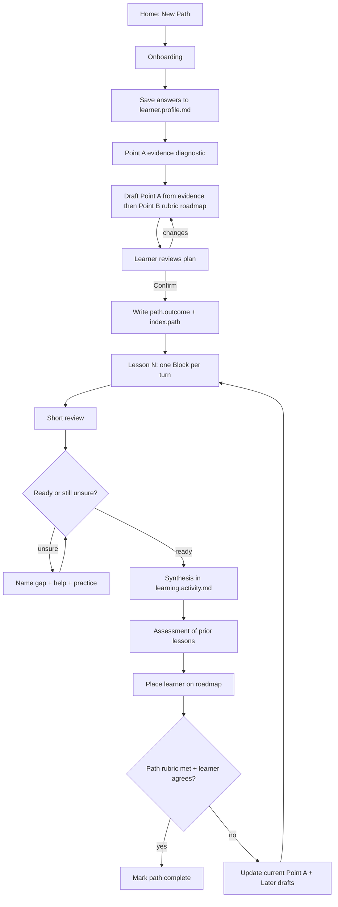
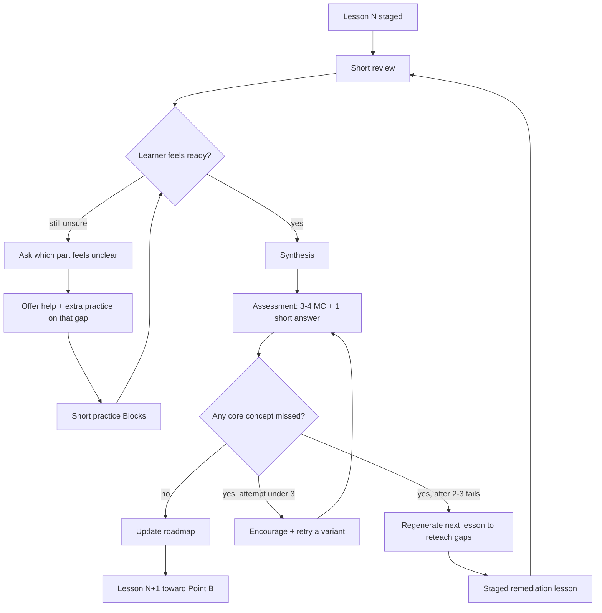
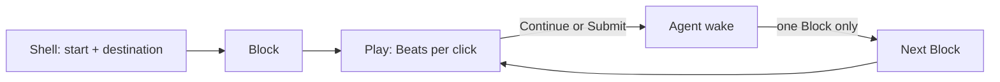

# Adaptive Point A → Point B Learning Loop

Extends the
[Player-native reshape](https://build-week.pathmx.net/work-log/2026-07-18-player-native-learning-reshape.brief):
confirm a plan, teach in small stages, review after each lesson, assess before
the next, then update the roadmap from evidence.

Kept here as the first design brief behind `/learn` and as a record of Tram Le
and Mark Johnson's early testing. That testing exposed the waiting and weak
progress structure in the one-Block-at-a-time loop described below. The current
contract is the [buffered loop](../skills/learn/references/buffered-loop.md), with
a compact [SQL library example](../skills/pathmx/library/examples/learn-sql-foundations/paths/sql-foundations/index.path.md).

| | |
| --- | --- |
| Canonical skill | `/learn` in this repository |
| Product target | `pathmx-learning-starter` |
| Demo topic | chess opening principles |
| Memory | durable Sources under `paths/`, not chat |

---

## Flow



**Between lessons:**



---

## Point A → Point B

Onboarding asks: goal, why, prior knowledge, stuck points, time/pace, preferred
feel. Answers go to `learner.profile.md`.

### Point A from evidence (required)

Do **not** invent Point A from vibes or a single “I know some openings”
sentence. After onboarding, the agent collects **proof of current level** so
scaffolding matches reality.

Learner may show evidence in **any one (or mix)** of these ways:

| Mode | What they provide | Notes |
| --- | --- | --- |
| **Past experience** | Courses, jobs, projects, how far they got, what failed | Short narrative is fine |
| **Artifact link** | Public repo, gist, notebook, portfolio, game history URL | Relative or public links only; no secrets |
| **Code / work sample** | Paste a small snippet or describe a commit they can open | Agent reads what they paste; keep it tiny |
| **Picture / screenshot** | Link or path to an image of a board, UI, notebook, grade, etc. | Prefer a workspace-relative asset or a public URL they choose to share |
| **Quick questions only** | 1–3 short placement items in the domain | Default when they have nothing to attach |

| Step | Agent does |
| --- | --- |
| 1 | Ask how they want to show level: artifact / experience / questions |
| 2 | Collect that evidence (keep it small — one artifact or a few questions) |
| 3 | If thin, ask **one** follow-up probe (question or “paste 5–10 lines”) |
| 4 | Score lightly against Point-A hypotheses; write Point A in observable language **citing the evidence** |
| 5 | Only then draft Point B, rubric, and roadmap at the proximal edge |

Chess demo: questions about a second move after `1. e4 e5`, or a link/screenshot
of a recent game. Other domains: repo + “what you built,” a notebook cell, a
screenshot of a dashboard, or three placement questions.

Persist evidence (onboarding Source / activity / profile note) so Confirm can
show “Point A based on…”. Never require credentials or private data.

| | Meaning | Chess demo default *(replace from evidence)* |
| --- | --- | --- |
| **Point A** | What they can do **now**, stated from diagnostic evidence | Legal moves; openings feel arbitrary; cannot yet use center / development / king safety to choose |
| **Point B** | What they will be able to do | First 8–10 moves by those principles; compare two moves; reject one early mistake; explain without a long memorized line |
| **Rubric** | Evidence for B | Name principles; justified choice; spot one mistake; short explained opening |

Point B changes only if renegotiated. Current Point A advances after review +
assessment. Later items are **titles only** until that lesson is next.

**Confirm screen:** Point A (with “based on your answers…”) , Point B, rubric,
Lesson 1 destination, 2–3 Later titles → **Request changes** or **Confirm
plan**. Persist `roadmap.status: confirmed`.

---

## Gates

| Before… | Require… |
| --- | --- |
| Draft Point A / roadmap | Onboarding + **Point A evidence diagnostic** |
| Lesson 1 teaching Blocks | Plan **Confirm** |
| Mark Lesson N complete | Short **review** |
| Open pre-next assessment | Learner says they are ready **or** finishes gap help / extra practice |
| Advance toward Point B (Lesson N+1) | Assessment with **no core concept missed** + placement written |
| After 2–3 assessment fails | Regenerated **remediation** lesson (not the ambitious Later draft) |
| After a failed remediation assessment | Plan **renegotiation** (smaller Point B or slower pace) — never a second remediation loop |
| Path complete | Path rubric met + learner agrees |

---

## Inside a lesson (staged, low token)



- One agent turn = one Block (`---` + stable `id`)
- Wake on Continue / Submit — not every Beat
- ~40–120 words per teaching/feedback Block
- Context: Point A/B, lesson destination, last 1–2 Blocks, latest response
- Persist the current stage/Block id in `index.lesson.md` frontmatter after each
  turn so reload resumes deterministically, not reconstructed from chat

**Lesson 1 stage sketch (chess):** shell → principles → board → check Q →
feedback → two moves → choose Q → feedback → justify → wrap → review.

---

## Review → assess → personalize

**After every lesson — short review:**

1. What can you do now that you could not at the start?
2. Do you feel ready for a quick check, or still unsure?
3. If still unsure: **which part** (concept / stage / example)? Keep it
   concrete — pick from the lesson’s core ideas when possible.
4. Agent offers **help + extra practice** on that gap only (1–3 short Blocks:
   re-explain simply, one worked example, one tiny check). Warm tone; no shame.
5. Learner can repeat gap → practice until they choose **ready for assessment**.

While profile fields remain "to be discovered," add at most one profile
question (format, pace, time) and write it back to `learner.profile.md`. Then
write synthesis to `learning.activity.md`, quoting the learner's own phrasing,
and append 1–2 retrieval-worthy concepts to the **review queue**. Does not
unlock Lesson N+1. Assessment stays gated until ready (or practice finished).

### Assessment (before every next lesson)

Keep it fair and encouraging — check understanding, not trick the learner.
First lesson: confirmed plan is enough; Assessment 1 gates Lesson 2.

**Default timing:** run the assessment at the **start of the next session**
when a session break occurs — the delay makes it spaced retrieval and it
doubles as a warm-up. Same-session assessment is fine when the learner wants
to keep going.

| Piece | Spec |
| --- | --- |
| Format | **3–4 multiple choice** + **1 short answer** + 1 optional **stretch item** drawn from the next Later title (never affects pass/fail) |
| Difficulty | Moderate; grounded in what Lesson N actually taught; when N ≥ 2, pull the oldest due item from the review queue in `learning.activity.md` |
| Pass bar | Every item is tagged to a rubric concept, marked **core** or peripheral. **Pass = no core concept missed.** A peripheral miss passes with a carry-forward note. No percentage — over 4–5 items a percentage is noise |
| Confidence | Ask a quick confidence rating per item; **confident-and-wrong** items are the top remediation targets (real misconceptions, not guesses) |
| Retries | On a core miss, encourage and retry with **variant items regenerated from the same rubric criteria** — never the identical MC set, which rewards answer-matching. After **2–3 failed attempts**, do **not** advance the ambitious Later draft — **regenerate the next lesson** to reteach the missed ideas more simply |
| Tone | Warm, specific praise for what they got right; gaps framed as the next practice move, never shame |

**Agent rubrics (required on the assessment Source):**

- Each MC item: correct option + short “why this is right / why others are weak”
- Short answer: 2–4 bullet criteria (what must appear); partial credit allowed
- Concept tags: every item names the rubric concept it evidences and whether
  that concept is **core** or peripheral for this lesson — this replaces
  numeric weights
- Agent evaluates against this rubric; persist result, attempt count, per-item
  confidence, which concepts were missed, and rough token cost in
  `learning.activity.md` — the pass and retry thresholds are guesses until a
  few paths of data calibrate them

### Placement → next lesson

| Result | Next lesson |
| --- | --- |
| Pass (no core miss) on track | Next Later draft toward Point B |
| Pass with a peripheral miss | Next lesson still advances, but opens with a short reteach of the carried-forward gap |
| Core miss, under 3 attempts | Motivate + retry a variant assessment |
| Core miss 2–3 times | Regenerate a **remediation lesson** (staged Blocks) aimed at missed concepts, confident-and-wrong items first; then review → assess again |
| Remediation assessment also fails | **Renegotiate the plan** — smaller Point B or slower pace, agreed with the learner; do not loop a second remediation |
| Stretch item answered well twice in a row | Offer to compress/skip a Later title (confirm if dropping a promise) |

Update after a pass: current Point A, Later list, Lesson N+1 `start`/`destination`
from assessed reality. Remediation lessons cite the failed items explicitly.

**Before designing any new lesson, read:** `path.outcome.md` → path index →
latest synthesis → assessment responses/scores → profile.

---

## Family tree

```text
Path (Point A → Point B)
├── 1. Shape the plan
│   ├── Onboarding → learner.profile.md
│   ├── Point A evidence (experience / repo / code / picture / questions)
│   ├── Draft A from evidence → B / rubric / Lesson 1 + Later titles
│   └── Confirm ──changes──► draft again
│              └──confirm──► lock Sources
│
├── 2. Lesson cycle (repeat until B)
│   ├── Lesson N (shell + staged Blocks; `stage` cursor; Beats per click)
│   ├── Short review
│   │   ├── Ready? ──unsure──► which gap? → help + practice ──► Ready?
│   │   └── Ready → synthesis + review queue
│   └── Assessment (3–4 MC + short + optional stretch; confidence)
│       ├── Pass = no core miss → place → Lesson N+1
│       ├── Core miss <3 → variant retry
│       ├── Core miss 2–3× → remediation lesson → review → assess
│       └── Remediation assess fails → renegotiate B / pace
│
└── 3. Path complete — rubric met + learner agrees
```

## Sources (learner workspace / fixture)

```text
paths/
├── index.path.md              # Home
├── learner.profile.md         # Onboarding + milestones, harvested via reviews
├── learning.activity.md       # Reviews, syntheses, placements, review queue
└── <path>/                    # e.g. chess-opening-principles/
    ├── index.path.md          # Current / Completed / Later
    ├── path.outcome.md        # A, B, rubric
    ├── onboarding/            # Questions + Point A evidence + confirm-plan
    └── lessons/<name>/
        ├── index.lesson.md    # Staged Blocks; frontmatter `stage` cursor
        ├── lesson.review.md   # Ready / gap gate
        ├── lesson.practice.md # Extra practice when unsure
        └── lesson.assessment.md
```

The retired Chess prototype remains recoverable from Git history. The current
playable example lives under
`skills/pathmx/library/examples/learn-sql-foundations/paths/sql-foundations/`.
Workflow briefs live in `work-log/`, not in synced learner Sources.

---

## Demo + build

**Demo:** New Path → onboard → Point A evidence diagnostic → confirm
A/B/roadmap → staged Lesson 1 → review → if unsure, gap + practice → when
ready, assessment → pass and personalize Lesson 2, or variant-retry /
remediation after repeated core misses → reload from lesson `stage` cursor.

**Build order:** confirm gate → shells → one-Block agent → review/synthesis →
pre-next assessment/placement → Lesson 2 from evidence → fallback Path →
Player writing/retry adapter.

**Out of scope:** multi-agent, full pre-gen courses, new components mid-lesson,
cross-path memory, submitting Core.
